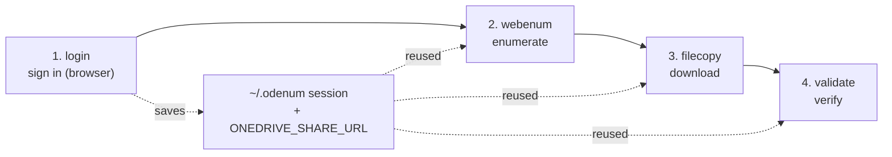

# OneDrive Enum

## Purpose

Produce a **defensible, dated record** of exactly what a OneDrive/SharePoint
**specific people** share contained, download every file, and prove the download
matches the record.

These shares authorize the **interactive web session**, not a delegated Graph token
from a third-party app — so the Graph API (and `rclone`, also a Graph client) return
**403 Forbidden** even when the recipient can open the share in a browser. This
toolset rides the browser session instead. Rationale:
[ADR-0001](docs/adr/ADR-0001-ENUMERATE-VIA-WEB-SESSION.md).

> **New here? Read [`docs/WORKFLOW.md`](docs/WORKFLOW.md)** — the step-by-step runbook
> (printable / distributable). This README is the developer overview.

## Setup

This project uses [uv](https://docs.astral.sh/uv/):

```bash
uv sync                                       # install deps + console commands
uv run python -m playwright install chromium  # one-time browser download
```

## The four-step workflow

Sign in **once**; the saved session (`~/.odenum`) and share URL (`ONEDRIVE_SHARE_URL`)
are reused by the later steps until the session expires. Run the tools from a
per-case data folder (e.g. `./data/`, git-ignored) — manifests and downloads land in
the current directory.



```bash
uv run login "<share-url>"     # 1. HEADED sign-in; saves session + remembers URL
uv run webenum enumerate       # 2. walk the share -> manifest.json + manifest.csv
uv run filecopy -c 8           # 3. download every file -> ./download/ (resumable)
uv run validate --hash         # 4. reconcile vs manifest; record a dated hash
```

- **`login`** — opens a real browser; sign in as the account the share was granted
  to. Saves the session to `~/.odenum/auth_state.json`
  ([ADR-0003](docs/adr/ADR-0003-AUTH-IN-USER-CONFIG-DIR.md)) and prints a one-liner to
  reuse the share URL this session (`ONEDRIVE_SHARE_URL`, **session-scoped by design**
  — [ADR-0004](docs/adr/ADR-0004-SHARE-URL-VIA-ENV-VAR.md)).
- **`webenum enumerate`** — share URL optional (defaults to `$ONEDRIVE_SHARE_URL`).
  Writes `manifest.json` and `manifest.csv` (the CSV opens with `#` provenance lines:
  share URL, timestamp, who enumerated). `webenum discover` is a diagnostic that logs
  the internal APIs a page calls; `webenum csv` regenerates the CSV from a manifest.
- **`filecopy`** — async, concurrency-capped (`-c`, the throughput knob), configurable
  retries (`--retries`, default 2 → 3 tries). Downloads via a Range-capable endpoint
  ([ADR-0002](docs/adr/ADR-0002-DOWNLOAD-VIA-DOWNLOAD-ASPX.md)) so it **resumes**: a
  file already present at its manifest size is skipped, a partial `.part` continues.
  Safe to stop and re-run. Logs to `filecopy.log` + `filecopy_results.csv`.
- **`validate`** — reports `OK`/`MISSING`/`MISMATCH`/`EXTRA` and PASS/FAIL. The web
  source exposes no hash, so the manifest check is **size + completeness**; `--hash`
  records each file's QuickXorHash — a dated fingerprint of the bytes you hold.

For an "anyone with the link" share, `uv run odenum` (Graph API, device-code auth) is
simpler and gives stronger per-file hashes; reach for the web-session tools when Graph
returns 403.

### Session expiry

The saved session expires after a few days. If a step returns `401`/`403` or lands on
a login page, run `uv run login` again (no URL needed) and continue — downloads resume
where they stopped.

### Setting the share URL for the session

`login` prints the line below for you; run it (or set it yourself) so `webenum` can
reuse the URL without retyping. This is **session-scoped on purpose** — the URL is
per-case, and a value persisted machine-wide would silently misapply to the next
case ([ADR-0004](docs/adr/ADR-0004-SHARE-URL-VIA-ENV-VAR.md)). Substitute your own
share link:

```powershell
# PowerShell (current terminal):
$env:ONEDRIVE_SHARE_URL = "https://contoso-my.sharepoint.com/:f:/r/personal/jdoe_contoso_com/Documents/Case%20Discovery?e=AbCd1234&sharingv2=true&fromShare=true"
```

```bash
# bash/zsh (current terminal):
export ONEDRIVE_SHARE_URL="https://contoso-my.sharepoint.com/:f:/r/personal/jdoe_contoso_com/Documents/Case%20Discovery?e=AbCd1234&sharingv2=true&fromShare=true"
```

> Quote the URL — it contains `&` and `?`. If you genuinely work one share for a long
> time and want it sticky across terminals, that's an opt-in choice (Windows `setx
> ONEDRIVE_SHARE_URL "…"`, or an `export` in your shell profile) — just remember to
> update it when you move to a new share.

## Project layout

```text
onedrive-enum/
├── src/onedrive_enum/     login, webenum, filecopy, validate, odenum   (tools)
│                          quickxor, shareurl, paths                    (shared helpers)
├── tests/                 pytest suite            (uv run pytest)
├── docs/
│   ├── WORKFLOW.md        user-facing runbook
│   ├── SPEC.md            forward-looking pipeline spec (Blob vault + review sync)
│   └── adr/               architecture decision records (the "why")
├── .claude/               team standards + rules (imported by CLAUDE.md)
├── pyproject.toml         package build + tooling config (ruff · mypy · pytest)
├── uv.lock                pinned dependency lockfile
└── data/                  per-case working data — manifests, download/ (git-ignored)

~/.odenum/                 auth session + token cache (per-user, outside the repo)
```

Quality gates: `uv run pytest`, `uv run ruff check .`, `uv run mypy src`.

## Data & secrets — never commit

Auth tokens live in `~/.odenum` (outside the repo); working data stays in the current
directory. All git-ignored — never commit or share:

- `~/.odenum/auth_state.json` — saved web session (**as sensitive as a password**)
- `~/.odenum/.token_cache.json` — MSAL token cache (odenum's Graph path)
- `data/`, `manifest*`, `raw/`, `download/`, `*.log`, `*_results.csv` — working data
