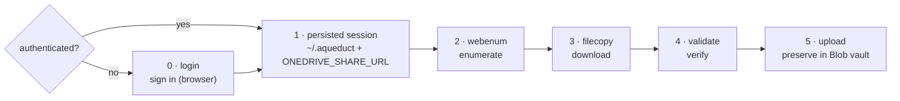

# Aqueduct

**Carry evidence intact from a OneDrive/SharePoint share to a defensible,
dated record — and prove nothing changed along the way.**

Aqueduct is, today, a rigorous **evidence-copying tool**: it enumerates exactly
what a OneDrive/SharePoint discovery share contained, downloads every file, and
proves the download matches the record. It is growing into a full **evidence data
pipeline** — preserve to an immutable vault, classify, and route to a review
surface — specified in [`docs/SPEC.md`](docs/SPEC.md).

> **Legal disclaimer:** Aqueduct is a software tool, not legal advice, and its
> authors are not lawyers. See [DISCLAIMER.md](DISCLAIMER.md).

## Purpose

Produce a **defensible, dated record** of exactly what a OneDrive/SharePoint
**specific people** share contained, download every file, and prove the download
matches the record.

These shares authorize the **interactive web session**, not a delegated Graph token
from a third-party app — so the Graph API (and `rclone`, also a Graph client) return
**403 Forbidden** even when the recipient can open the share in a browser. Aqueduct
rides the browser session instead. Rationale:
[ADR-0001](docs/adr/0001-ENUMERATE-VIA-WEB-SESSION.md).

**Proven at scale.** Aqueduct has been stress-tested against large evidentiary
repositories **exceeding 500 GB** and **more than 12,000 files**, downloading and
reconciling the full set resumably.

**Runs locally, nothing phones home.** Aqueduct talks only to the Microsoft share
you were granted and your own local disk — no telemetry, no third-party services, no
cloud dependency. Downloaded evidence never passes through anyone else's servers, and
the local-disk workflow can run offline once files are in hand, so using it does not
expose privileged or confidential material to any outside party.

> **New here? Read [`docs/WORKFLOW.md`](docs/WORKFLOW.md)** — the step-by-step runbook
> (printable / distributable). This README is the developer overview.

## License

Aqueduct is released under the **[MIT License](LICENSE)** — free to use, copy,
modify, and distribute, for any purpose, with attribution. Use it freely.

## Setup

This project uses [uv](https://docs.astral.sh/uv/):

```bash
uv sync                                       # install deps + console commands
uv run python -m playwright install chromium  # one-time browser download
```

## The workflow

**Step 0 (`login`) is only needed when you're not already authenticated.** It signs
you in and **persists (step 1) the session (`~/.aqueduct`) and share URL
(`ONEDRIVE_SHARE_URL`)**, which steps 2–4 reuse until the session expires — so on a
machine that's already signed in you skip straight to enumerate. Run the tools from a
per-case data folder (e.g. `./data/`, git-ignored); manifests and downloads land in
the current directory.



```bash
uv run login "<share-url>"     # 0 · sign in (only if NOT already authenticated)
                               # 1 · ~/.aqueduct session + ONEDRIVE_SHARE_URL now persisted & reused
uv run webenum enumerate       # 2 · walk the share -> manifest.json + manifest.csv
uv run filecopy -c 8           # 3 · download every file -> ./download/ (resumable)
uv run validate --hash         # 4 · reconcile vs manifest; record a dated hash
uv run upload --dest-prefix <matter>/<collection>   # 5 · preserve in the Azure Blob vault (see docs/WORKFLOW.md)
```

- **`login` (step 0 — only if not already authenticated)** — opens a real browser;
  sign in as the account the share was granted to. This is what **persists (step 1)**
  the session to `~/.aqueduct/auth_state.json`
  ([ADR-0003](docs/adr/0003-AUTH-IN-USER-CONFIG-DIR.md)) and prints a one-liner to
  reuse the share URL this session (`ONEDRIVE_SHARE_URL`, **session-scoped by design**
  — [ADR-0004](docs/adr/0004-SHARE-URL-VIA-ENV-VAR.md)). If a valid session already
  exists, skip straight to step 2.
- **`webenum enumerate`** — share URL optional (defaults to `$ONEDRIVE_SHARE_URL`).
  Writes `manifest.json` and `manifest.csv` (the CSV opens with `#` provenance lines:
  share URL, timestamp, who enumerated). `webenum discover` is a diagnostic that logs
  the internal APIs a page calls; `webenum csv` regenerates the CSV from a manifest.
- **`filecopy`** — async, concurrency-capped (`-c`, the throughput knob), configurable
  retries (`--retries`, default 2 → 3 tries). Downloads via a Range-capable endpoint
  ([ADR-0002](docs/adr/0002-DOWNLOAD-VIA-DOWNLOAD-ASPX.md)) so it **resumes**: a
  file already present at its manifest size is skipped, a partial `.part` continues.
  Safe to stop and re-run. Logs to `filecopy.log` + `filecopy_results.csv` (with an
  inline SHA-256 captured as bytes stream in).
- **`validate`** — reports `OK`/`MISSING`/`MISMATCH`/`EXTRA` and PASS/FAIL. The web
  source exposes no hash, so the manifest check is **size + completeness**; `--hash`
  records each file's **SHA-256** — the forensic integrity fingerprint of the exact
  bytes you hold ([ADR-0006](docs/adr/0006-SHA256-INTEGRITY-HASH.md)).

### Session expiry

The saved session expires after a few days. If a step returns `401`/`403` or lands on
a login page, run `uv run login` again (no URL needed) and continue — downloads resume
where they stopped.

### Setting the share URL for the session

`login` prints the line below for you; run it (or set it yourself) so `webenum` can
reuse the URL without retyping. This is **session-scoped on purpose** — the URL is
per-case, and a value persisted machine-wide would silently misapply to the next
case ([ADR-0004](docs/adr/0004-SHARE-URL-VIA-ENV-VAR.md)). Substitute your own
share link:

```powershell
# PowerShell (current terminal):
$env:ONEDRIVE_SHARE_URL = "https://contoso-my.sharepoint.com/:f:/r/personal/jdoe_contoso_com/Documents/Case%20Discovery?e=AbCd1234&sharingv2=true&fromShare=true"
```

```bash
# bash/zsh (current terminal):
export ONEDRIVE_SHARE_URL="https://contoso-my.sharepoint.com/:f:/r/personal/jdoe_contoso_com/Documents/Case%20Discovery?e=AbCd1234&sharingv2=true&fromShare=true"
```

> Quote the URL — it contains `&` and `?`. If you genuinely work one share for a long
> time and want it sticky across terminals, that's an opt-in choice (Windows `setx
> ONEDRIVE_SHARE_URL "…"`, or an `export` in your shell profile) — just remember to
> update it when you move to a new share.

## Project layout

```text
aqueduct/
├── src/aqueduct/         login, webenum, filecopy, validate, upload   (tools)
│                         shareurl, paths                       (shared helpers)
├── tests/                pytest suite            (uv run pytest)
├── docs/
│   ├── WORKFLOW.md       user-facing runbook
│   ├── SPEC.md           forward-looking pipeline spec (Blob vault + review sync)
│   └── adr/              architecture decision records (the "why")
├── .claude/              team standards + rules (imported by CLAUDE.md)
├── LICENSE               MIT
├── DISCLAIMER.md         no-legal-advice disclaimer
├── pyproject.toml        package build + tooling config (ruff · mypy · pytest)
├── uv.lock               pinned dependency lockfile
└── data/                 per-case working data — manifests, download/ (git-ignored)

~/.aqueduct/                auth session (per-user, outside the repo)
```

Quality gates: `uv run pytest`, `uv run ruff check .`, `uv run mypy src`.

## Data & secrets — never commit

Auth tokens live in `~/.aqueduct` (outside the repo); working data stays in the current
directory. All git-ignored — never commit or share:

- `~/.aqueduct/auth_state.json` — saved web session (**as sensitive as a password**)
- `data/`, `manifest*`, `raw/`, `download/`, `*.log`, `*_results.csv` — working data

## Sister projects

Aqueduct is one of a family of tools for defense-side evidence handling:

- **`classifier`** — classifies evidence (document type, content category, and review
  routing) over an acquired evidence set. It is the classification stage of the wider
  pipeline described in [`docs/SPEC.md`](docs/SPEC.md).
- **`call-inventory`** *(coming soon)* — lets defense attorneys rebuild call-recording
  databases into a normalized form for analyzing the call records provided by police
  and prosecutors.
