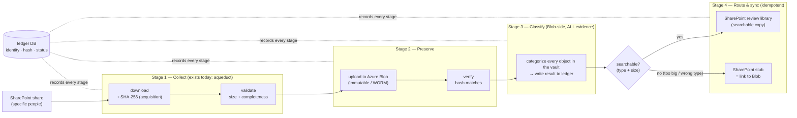

# SPEC — Evidence Preservation & Review Pipeline

> **Status: Draft — partly implemented.** This describes a *later product* that builds
> on the current `aqueduct` tooling. **Stage 1** (download + hash + validate) and
> **Stage 2** (`upload` to the Blob vault, from the local download) exist today; Stages
> 3–4 are specified here, not yet implemented.
> Examples are generic; substitute real tenants/containers when building.

## 1. Purpose

Take a legal-discovery share (OneDrive/SharePoint "specific people") and produce a
**defensible, immutable, searchable** evidence set:

1. **Preserve** every file, byte-for-byte, in an immutable WORM vault (Azure Blob),
   with an integrity hash captured at the moment of collection.
2. **Review** the material in SharePoint via Copilot/M365 Search — but only the
   files that can actually be text-indexed; everything else is represented by a
   link back to the vault.
3. **Prove** at every step, by hash, that what moved is exactly what was collected,
   with a full audit trail.

The **Azure Blob vault is the source of truth.** SharePoint is a *derived* review
surface. A database is the *ledger* that tracks state; it never holds evidence.

## 2. Pipeline overview



## 3. Tiers and their roles

| Tier | Role | Mutability | Who can write | Who can read |
|---|---|---|---|---|
| **Azure Blob vault** | Authoritative evidence store | **Immutable (WORM)** — time-based retention or legal hold | IT / paralegal (uploader) via automation | Lawyers **read-only** |
| **Ledger database** | State & audit trail (identity, hash, per-stage status, timestamps, resets) | Append-mostly; status transitions logged | Pipeline service | Auditors / operators |
| **SharePoint review library** | Search/review surface (derived) | Read-only to reviewers; retention-labeled | Pipeline service | Lawyers (review) |

## 4. Integrity model

- **Hash = SHA-256**, computed **inline at acquisition** (Stage 1) as bytes stream
  from the source — free (no extra read), and recorded in the ledger. SHA-256 is
  the forensic standard, cryptographically tamper-evident, and HW-accelerated
  (~3.4 GB/s here vs ~43 MB/s for Microsoft's QuickXorHash, which is unavailable
  from this share anyway — see the tool's ADRs).
- **The same hash is re-checked at every boundary**: local→Blob (verify after
  upload), Blob→SharePoint (verify after sync). A stage is only "completed" when
  the hash matches — never merely because bytes arrived.

**SHA-256 and MD5 are two layers with different jobs — they don't compete:**

| | SHA-256 | MD5 |
|---|---|---|
| Role | **the evidence fingerprint** (chain of custody) | **Azure's transport/content check** |
| Who computes it | us, inline, and re-verified at each hop | Azure, per block on receipt + blob `Content-MD5` on commit |
| Properties | cryptographic, tamper-evident, portable (`sha256sum`) | fast, non-cryptographic; guards the wire, enables Azure-native verify |
| Where it lives | the ledger (authoritative) | on the blob (Azure metadata) |

So during a stream-to-Blob upload ([ADR-0008](adr/0008-STREAM-TO-BLOB-PRESERVATION.md)),
each chunk both **updates our SHA-256** (evidence) and is **staged with content
validation** so Azure verifies its MD5/CRC64 on arrival (transport). SHA-256 is the
authoritative fingerprint; MD5 is belt-and-suspenders at the storage layer and lets
Azure-native tools verify the blob without our tooling. See
[ADR-0006](adr/0006-SHA256-INTEGRITY-HASH.md) for why SHA-256 (not QuickXorHash).

## 5. Idempotency, state machine & ledger

Every file is tracked in the ledger and every stage is **idempotent**: a file that
is already completed for a stage is skipped forever, **unless its status is
intentionally reset** (a logged custody event).

**Identity key = SharePoint `UniqueId`/GUID + SHA-256.** Identity answers "which
item"; the hash answers "which exact bytes." Together they survive renames and
catch silent substitution.

**Per-stage state machine** (applies to collect, preserve, and sync):

```text
PENDING → IN_PROGRESS → ARRIVED → VERIFIED(=completed)
                                   │
                         reset ◄───┘   (logged: who / when / why)
```

- "Completed" means **hash-verified**, not just "downloaded/uploaded."
- A crash mid-stage leaves the file in `IN_PROGRESS`/`ARRIVED`, so re-runs retry
  only the unfinished — the DB generalization of Stage 1's `.part`/skip logic.

**Ledger schema (illustrative):**

| Field | Notes |
|---|---|
| `item_id` | SharePoint UniqueId/GUID (stable identity) |
| `path` | server-relative path within the share |
| `size_bytes` | from the source manifest |
| `sha256` | acquisition-time fingerprint |
| `md5` | optional, for Azure `Content-MD5` |
| `blob_url` | vault location once preserved |
| `collect_status` / `preserve_status` / `sync_status` | state-machine values |
| `classification` | `searchable` \| `link_only` (+ reason) |
| `*_verified_at` | timestamps per stage |
| `resets` | append-only list of {when, who, reason} |

**The ledger must be tamper-evident** — it *is* the chain-of-custody record, not just
bookkeeping. It lives in a verifiable stateful store (default: **Azure SQL ledger
tables**), with its digest periodically **anchored in immutable WORM Blob** so trust
sits outside the mutable store; **Azure Confidential Ledger** is the stronger
tamper-proof option, and hash-chaining rows is the portable minimum. It is a **managed**
service the end user never administers. Full reasoning:
[ADR-0009](adr/0009-TAMPER-EVIDENT-LEDGER.md).

## 6. Classification (Stage 3) — Blob-side, over ALL evidence

**Preserve first, classify second — but classify everything.** Classification is a
*mandatory, complete* categorization of the entire evidence set, not a filter for
what happens to reach SharePoint. **All evidence must be categorized**, including the
large/non-extractable files that will only ever be represented in SharePoint as a
link. Two consequences follow:

- **It runs on the Blob side, over the whole vault** — the authoritative, complete,
  immutable set — so nothing is missed. Classifying only the SharePoint-bound subset
  would silently skip every link-only item, which is unacceptable.
- **Results are written to the ledger, never to the Blob.** The vault is immutable
  (WORM), so classification annotates the *ledger* (and later, SharePoint metadata
  for the searchable copies) — it does not, and must not, modify the preserved
  objects.

This is the **asynchronous AI stage**: content categorization, document type, OCR of
scanned PDFs, PII/privilege flags, custodian, relevance. It runs at its own pace over
the vault and gates nothing upstream.

Keep it distinct from the much cheaper **extractability decision** used for routing
(Stage 4), which is a **deterministic type + size rule**, not AI:

- *Searchable* → an allow-list of Copilot/M365-indexable types (Office, PDF, TXT,
  HTML, …) under SharePoint's text-extraction size limit.
- *Link-only* → everything else: video (`.mp4`), forensic images (`.ufdr`, `.g64`),
  executables (`.exe`), very large archives, and anything over the size cap.

So every object gets a **classification** (comprehensive, vault-side) *and* a
**routing verdict** (deterministic, at sync time); the two are recorded separately in
the ledger.

## 7. SharePoint sync (Stage 4)

**Every evidence item is represented in SharePoint** — either as a searchable copy
of the file, or as a **metadata-bearing stub** that links to the Blob. Both forms
carry the *same* full evidence metadata, so the review surface is a complete
inventory of the vault regardless of which items hold bytes.

Workflow per searchable file routed to SharePoint:

1. Download from the Blob into the target Discovery folder (library).
2. Validate by hash that the correct bytes arrived.
3. Mark the file **completed** in the ledger; never download it again unless the
   status is intentionally reset.

**Stubs are records, not bare links.** Each link-only item carries the full evidence
metadata — identity (`UniqueId`/GUID), source path, size, `sha256`, created/modified
dates, custodian, classification, and the Blob URL — so it is a complete, queryable
record of that piece of evidence even though its bytes live only in the vault. This
is what makes the completeness check (§8) possible across the *entire* set.

Sync hygiene:

- Large / non-extractable files are **never** stored in SharePoint — only their
  metadata stubs — so the review surface stays small and Copilot indexes only what
  it can read.
- The review library has **sync disabled or files set online-only**, so evidence is
  never materialized onto reviewer endpoints (bandwidth + custody).
- Reviewer permissions are **read-only**; a retention label marks the library a
  record. The Blob remains the immutable authority regardless.

**Direct-upload shortcut (`spupload`, [ADR-0012](adr/0012-DIRECT-GRAPH-UPLOAD-TO-SHAREPOINT.md)).**
An operator with Graph access to their own destination site can upload the validated
local download straight to a SharePoint library, **bypassing the vault**. This is a
deliberate, non-evidentiary shortcut — a convenience/review copy only. The command warns,
and its results CSV and sidecar record that the vault was bypassed. It is a standalone
tool, not Stage 4: it does not feed or replace the Blob → SharePoint sync above, and it
writes no ledger records. Verification is size plus SharePoint's `quickXorHash` (the only
hash SharePoint reports), with our SHA-256 recorded alongside.

## 8. Completeness reconciliation (deterministic checklist)

Because every item — searchable file and stub alike — carries uniform metadata, the
full evidence inventory can be reconciled **deterministically** against a **separate
required-evidence checklist** for the matter, to answer the discovery question: *what
is included, and what is missing?*

- The checklist is authored independently of collection (it states what evidence
  *should* exist). Reconciliation is a **deterministic join** — inventory vs.
  checklist, keyed by identity/type/custodian — **not** an AI judgment; it must be
  reproducible and explainable.
- Output is an **included / missing / unexpected** report: every checklist entry
  matched to present evidence, every gap named, and any evidence present but not on
  the checklist flagged.
- The check runs over the metadata (ledger + SharePoint stubs), so it covers
  link-only items exactly like searchable ones — nothing is invisible to it just
  because its bytes are in the vault rather than SharePoint.
- Distinct from the byte-level `validate` (size + `sha256`, "are the bytes intact?"):
  this is inventory-level ("is the *right set* of evidence present, per the
  checklist?").

## 9. Access & immutability requirements

- Blob container under a **time-based immutability policy and/or legal hold** (WORM;
  meets records-retention obligations).
- **Role separation** (Azure RBAC): only the pipeline identity / IT / paralegal
  uploader holds a write role (`Storage Blob Data Contributor`); lawyers hold
  **read-only** (`Storage Blob Data Reader`). No interactive write path for
  reviewers to alter evidence.
- Every state change and every reset is recorded in the ledger for audit.

## 10. Hosting & operating model

The intended users are **independent / small defense-counsel practices with limited
resources and no IT staff**, so the operating model optimizes for *teachability and
zero server management* — see [ADR-0007](adr/0007-DESKTOP-VM-OPERATING-MODEL.md).

- **Primary — desktop VM (cloud PC).** A paralegal signs in to the share in the
  desktop's own browser and runs the tool; no server to administer, no injected
  credentials. Heavy integrity (WORM vault, tamper-evident ledger) lives in **managed
  Azure services the user never administers**.
- **Preserve by streaming** — on the desktop, evidence is streamed **straight to the
  Blob vault and never lands locally** (the FSLogix profile disk is small/volatile, and
  evidence shouldn't linger). Only transient in-RAM chunks touch the machine. Restart
  is ledger-driven; see [ADR-0008](adr/0008-STREAM-TO-BLOB-PRESERVATION.md).
- **Option — server/container** for resourced organizations wanting automated,
  scheduled, IaC-managed collection.
- **Option — local disk** download + validate, for users who just want files on a drive
  and no cloud. (This is what the shipped tool does today.)

The one manual touch on any host is the **interactive MFA login** to mint/refresh the
web session — a feature on the desktop (familiar browser sign-in), a Key-Vault-fed step
on a server.

## 11. Relationship to `aqueduct` (today)

- **Stage 1 exists**: `login` → `webenum` (dated manifest) → `filecopy` (download +
  inline SHA-256 in `filecopy_results.csv`) → `validate` (size/completeness). This
  is the collection tier and the seed of the ledger.
- **`spupload` exists** as an optional, vault-bypassing direct upload of the validated
  download to SharePoint (see §7 and ADR-0012); it is not part of the pipeline stages.
- **Stage 2 exists** as `upload`: it sends the validated local download to the immutable
  Blob vault, verifies size + SHA-256 + `Content-MD5` after commit, and stores the
  acquisition record (`manifest`, results CSVs, `SHA256SUMS`, `custody.json`) under
  `_audit/` beside the evidence ([ADR-0013](adr/0013-UPLOAD-TO-IMMUTABLE-BLOB.md)).
  Streaming without a local copy (§10, ADR-0008) is not built yet.
- **Stages 3–4 are new components** to build against this spec: classifier/router and
  SharePoint sync, plus the ledger database that ties them together.

## 12. Open questions

- Ledger store: managed SQL vs. a lightweight embedded DB for a single-operator
  deployment.
- Exact SharePoint text-extraction size/type limits to encode in the router
  (verify against current M365 behavior).
- Whether stubs are SharePoint list items, `.url`/`.lnk` files, or a custom content
  type carrying the Blob URL + hash + metadata.
- Chain-of-custody export format (a signed, dated report joining manifest + ledger).
- Re-collection semantics: how a "reset" interacts with an already-immutable Blob
  (new version vs. new object under the retention policy).
