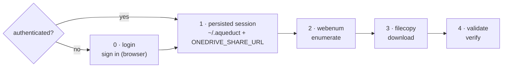

# Aqueduct — Workflow

A step-by-step guide to using **Aqueduct** to produce a **dated, defensible record**
of a OneDrive / SharePoint "specific people" share, downloading every file, and
proving the download matches the record.

> **Examples use a fictional share.** Replace the sample URL, account, and host with
> your own everywhere they appear:
> `https://contoso-my.sharepoint.com/:f:/r/personal/jdoe_contoso_com/Documents/Case%20Discovery?e=AbCd1234&sharingv2=true&fromShare=true`

---

## Overview

**Step 0 (`login`) is only needed if you're not already signed in.** It persists
(step 1) the session (`~/.aqueduct`) and share URL, which steps 2–4 reuse until the
session expires — so on a machine that's already authenticated, start at step 2.



| Step | Command | Produces |
|------|---------|----------|
| 0. Sign in (if needed) | `login "<share-url>"` | Saved session in `~/.aqueduct` + remembered URL |
| 1. (persisted) | — | `~/.aqueduct` session + `ONEDRIVE_SHARE_URL`, reused by steps 2–4 |
| 2. Enumerate | `webenum enumerate` | `manifest.json` + `manifest.csv` (the dated record) |
| 3. Download | `filecopy -c 8` | Every file under `download/` |
| 4. Validate | `validate --hash` | `validate_results.csv` (pass/fail + hashes) |

---

## Prerequisites (once per machine)

This project uses [uv](https://docs.astral.sh/uv/).

```bash
uv sync                                      # install the tools
uv run python -m playwright install chromium # one-time browser download
```

Create a folder for **this case's** data and work from it (data stays out of the
project and is git-ignored):

```bash
mkdir -p data && cd data
```

All commands below are run with `uv run <command>` from that folder.

---

## Step 0 — Sign in (only if not already authenticated)

```bash
uv run login "<share-url>"
```

A real browser window opens. Sign in as the account the share was granted to, tick
**"Stay signed in"** if offered, and wait until you can actually see the shared
files. Return to the terminal and press **Enter**.

This saves the session to `~/.aqueduct/auth_state.json` and prints a command to set
`ONEDRIVE_SHARE_URL` for the current terminal, so `webenum enumerate` needs no URL.
The URL is per-case, so it is **not** kept across terminals — in a new terminal, run
`login` again (or pass the URL) rather than risk enumerating the wrong share.

> The saved session is **as sensitive as a password** and **expires** after a few
> days. If a later step reports `401`/`403` or lands on a login page, run `uv run
> login` again (no URL needed) and continue.

---

## Step 2 — Enumerate (build the record)

```bash
uv run webenum enumerate
```

Walks the entire share and writes:

- **`manifest.json`** — the complete machine-readable record (every file and folder:
  path, size, dates, ids; plus provenance: the share URL, timestamp, and who ran it).
- **`manifest.csv`** — the same as a spreadsheet, opening with `#` provenance lines so
  the file is self-identifying as evidence.

Open `manifest.csv` to review what the share contained.

---

## Step 3 — Download every file

```bash
uv run filecopy -c 8
```

Downloads every file in the manifest into `download/`, preserving the folder
structure.

- `-c 8` runs 8 downloads at once (raise/lower to match your bandwidth).
- **Safe to stop and re-run.** Completed files are skipped; a partially downloaded
  file resumes where it left off. Just run the same command again.
- Progress is logged to the screen and to `filecopy.log`; a per-file result table is
  written to `filecopy_results.csv`.

For a big share this can take a while. If the session expires mid-run, re-run
`login`, then re-run `filecopy` — it picks up where it stopped.

---

## Step 4 — Validate the download

```bash
uv run validate --hash
```

Reconciles `download/` against `manifest.json` and reports, per file:

- **OK** — present and the right size
- **MISSING** — in the record but not downloaded
- **MISMATCH** — present but wrong size
- **EXTRA** — on disk but not in the record

It prints **PASS** or **FAIL** and writes `validate_results.csv`. `--hash` also
records each file's SHA-256 — a dated fingerprint of the exact bytes you hold,
useful for proving later that nothing changed.

If anything fails, re-run `filecopy` to fill the gaps, then validate again.

---

## What you keep as evidence

From the case data folder:

- `manifest.json` and `manifest.csv` — what the share contained, dated.
- `download/` — the files themselves.
- `filecopy_results.csv` and `validate_results.csv` — proof of what was retrieved and
  that it matches the record.

## Troubleshooting

| Symptom | Cause | Fix |
|---|---|---|
| `401` / `403`, or a login page appears | Saved session expired | `uv run login` (no URL), then re-run the step |
| `No share URL given and ONEDRIVE_SHARE_URL is not set` | New terminal without the URL | `uv run login "<share-url>"`, or set `ONEDRIVE_SHARE_URL` |
| Download stopped | Interrupted / network drop | Re-run `uv run filecopy` — it resumes |
| Validate shows MISSING/MISMATCH | Incomplete download | Re-run `uv run filecopy`, then `uv run validate` |
