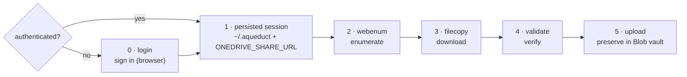

# Aqueduct — Workflow

A step-by-step guide to using **Aqueduct** to produce a **dated, defensible record**
of a OneDrive / SharePoint "specific people" share, downloading every file, and
proving the download matches the record.

> **Examples use a fictional share.** Replace the sample URL, account, and host with
> your own everywhere they appear:
> `https://contoso-my.sharepoint.com/:f:/r/personal/jdoe_contoso_com/Documents/Case%20Discovery?e=AbCd1234&sharingv2=true&fromShare=true`

---

## Overview

**Step 0 (`login`) is only needed if you're not already signed in.** It persists
(step 1) the session (`~/.aqueduct`) and share URL, which steps 2–4 reuse until the
session expires — so on a machine that's already authenticated, start at step 2.



| Step | Command | Produces |
|------|---------|----------|
| 0. Sign in (if needed) | `login "<share-url>"` | Saved session in `~/.aqueduct` + remembered URL |
| 1. (persisted) | — | `~/.aqueduct` session + `ONEDRIVE_SHARE_URL`, reused by steps 2–4 |
| 2. Enumerate | `webenum enumerate` | `manifest.json` + `manifest.csv` (the dated record) |
| 3. Download | `filecopy -c 8` | Every file under `download/` |
| 4. Validate | `validate --hash` | `validate_results.csv` (pass/fail + hashes) |
| 5. Preserve | `upload --dest-prefix <matter>/<collection>` | Evidence + audit record in the Blob vault; `upload_results.csv` |

---

## Prerequisites (once per machine)

This project uses [uv](https://docs.astral.sh/uv/).

```bash
uv sync                                      # install the tools
uv run python -m playwright install chromium # one-time browser download
```

Create a folder for **this case's** data and work from it (data stays out of the
project and is git-ignored):

```bash
mkdir -p data && cd data
```

All commands below are run with `uv run <command>` from that folder.

---

## Step 0 — Sign in (only if not already authenticated)

```bash
uv run login "<share-url>"
```

A real browser window opens. Sign in as the account the share was granted to, tick
**"Stay signed in"** if offered, and wait until you can actually see the shared
files. Return to the terminal and press **Enter**.

This saves the session to `~/.aqueduct/auth_state.json` and prints a command to set
`ONEDRIVE_SHARE_URL` for the current terminal, so `webenum enumerate` needs no URL.
The URL is per-case, so it is **not** kept across terminals — in a new terminal, run
`login` again (or pass the URL) rather than risk enumerating the wrong share.

> The saved session is **as sensitive as a password** and **expires** after a few
> days. If a later step reports `401`/`403` or lands on a login page, run `uv run
> login` again (no URL needed) and continue.

---

## Step 2 — Enumerate (build the record)

```bash
uv run webenum enumerate
```

Walks the entire share and writes:

- **`manifest.json`** — the complete machine-readable record (every file and folder:
  path, size, dates, ids; plus provenance: the share URL, timestamp, and who ran it).
- **`manifest.csv`** — the same as a spreadsheet, opening with `#` provenance lines so
  the file is self-identifying as evidence.

Open `manifest.csv` to review what the share contained.

---

## Step 3 — Download every file

```bash
uv run filecopy -c 8
```

Downloads every file in the manifest into `download/`, preserving the folder
structure.

- `-c 8` runs 8 downloads at once (raise/lower to match your bandwidth).
- **Safe to stop and re-run.** Completed files are skipped; a partially downloaded
  file resumes where it left off. Just run the same command again.
- Progress is logged to the screen and to `filecopy.log`; a per-file result table is
  written to `filecopy_results.csv`.

For a big share this can take a while. If the session expires mid-run, re-run
`login`, then re-run `filecopy` — it picks up where it stopped.

---

## Step 4 — Validate the download

```bash
uv run validate --hash
```

Reconciles `download/` against `manifest.json` and reports, per file:

- **OK** — present and the right size
- **MISSING** — in the record but not downloaded
- **MISMATCH** — present but wrong size
- **EXTRA** — on disk but not in the record

It prints **PASS** or **FAIL** and writes `validate_results.csv`. `--hash` also
records each file's SHA-256 — a dated fingerprint of the exact bytes you hold,
useful for proving later that nothing changed.

If anything fails, re-run `filecopy` to fill the gaps, then validate again.

---

## Step 5 — Preserve in the Azure Blob vault

Sends the validated download to an **immutable (WORM) Blob container** and proves, by
hash, that what arrived is what you collected. See
[ADR-0013](adr/0013-UPLOAD-TO-IMMUTABLE-BLOB.md).

One-time setup (your IT/Azure admin): a storage account with a container that has a
time-based retention policy and/or legal hold, and your Azure identity holding
`Storage Blob Data Contributor` on it. Sign in with `az login` (or any identity
`DefaultAzureCredential` understands). No keys, SAS tokens, or secrets are used.

Choose a **folder for this collection** inside the container and never reuse it:

```text
<container>/
  <matter-id>/                     e.g. 2026-0042-smith
    <collection-id>/               e.g. 20261004-share-a   (one per enumerate/download run)
      data/<original path...>      the evidence, exactly as in manifest.json
      _audit/<run-id>/             the acquisition record for each upload run
```

```bash
uv run upload --account-url https://contoso.blob.core.windows.net --container vault     --dest-prefix 2026-0042-smith/20261004-share-a
```

(or set `AQUEDUCT_BLOB_ACCOUNT_URL`, `AQUEDUCT_BLOB_CONTAINER`, `AQUEDUCT_BLOB_PREFIX`).

What it does:

- Uploads only files that passed `validate --hash` **and** whose hash matches what
  `filecopy` recorded. Each file is hashed as it is read for upload and compared to the
  validated hash before anything is committed; a file that changed since `validate` is
  **rejected**, not uploaded.
- Looks the blob up by name **before** reading the local file, so a re-run only reads
  the files whose blob already exists at the same size (to skip or flag them).
- Sends each file in blocks, several at once (`--block-workers`, default 4), that Azure
  checks on arrival, then stores the file's **SHA-256** (the evidence fingerprint) and
  its source `UniqueId` on the blob. `--hash-workers` (default 3) caps how many files
  are hashed at once.
- Logs `progress: N/M files, X/Y GB` every 30 seconds and announces big files as they
  start; `upload_results.csv` is checkpointed every 100 files or 30 seconds, so an
  interrupted run still leaves a record.
- A file counts as done only when the stored blob is read back and its size, SHA-256
  and Content-MD5 match. Anything else is a `fail`.
- Safe to re-run: files already preserved with the same hash are skipped. A blob that
  already exists with a **different** hash is a `conflict` and is never overwritten.
- Finally stores the **acquisition record** beside the evidence in
  `_audit/<run-id>/`: `manifest.json`/`.csv`, `filecopy_results.csv`,
  `validate_results.csv`, `upload_results.csv` (each with its `.metadata.json`
  sidecar), `summary.md`, a `SHA256SUMS` file (verify any file later with `sha256sum -c`), and
  `custody.json`, which records the hash of `SHA256SUMS`. Each run adds its own
  `<run-id>` folder; earlier ones are never touched. Add more with `--audit-file`.

`summary.md` is the one page to read first: overall PASS/FAIL, the vault destination,
total bytes, and a table of how many files were downloaded, validated and uploaded, with
the failures broken down by status (missing, mismatch, hash mismatch, extra, rejected,
conflict, ...). A **Definitions** section explains every status as the tool defined it
when the page was written. A stage with no results file shows as "not run". The page is
listed in `SHA256SUMS`, so it cannot also carry that file's hash; it shows the hash of the
`data/` lines instead, and the run prints the full `SHA256SUMS` hash for you to record.

**Write down the SHA-256 of `SHA256SUMS`** (it is in `custody.json`) somewhere outside
the vault — a ticket or email. It anchors the whole record. This trail is not the
tamper-evident ledger ([ADR-0009](adr/0009-TAMPER-EVIDENT-LEDGER.md)); it cannot prove
custody events after the upload.

---

## Step 6 — (Optional) Upload to SharePoint

> **This bypasses the Azure Blob vault.** The SharePoint copy is a convenience/review
> copy, **not evidence** — the command warns, and records the bypass in its results.
> See [ADR-0012](adr/0012-DIRECT-GRAPH-UPLOAD-TO-SHAREPOINT.md).

Use this only if you have Microsoft Graph access to **your own** destination site.
One-time setup: register an app in the destination tenant, grant it the
`Sites.Selected` permission (with admin consent), and grant it write access to the one
target site. Then save its details in `~/.aqueduct/graph.json` (fictional values):

```json
{ "tenant_id": "00000000-0000-0000-0000-000000000000", "client_id": "11111111-1111-1111-1111-111111111111" }
```

Put the client secret in the `AQUEDUCT_GRAPH_CLIENT_SECRET` environment variable (or a
`client_secret` field in that file). Never commit it or paste it into logs.

Run it after `validate --hash` has passed (Step 5 is not required), naming the **site, document library, and
folder** — either as one pasted folder URL, or as separate options:

```bash
uv run spupload --dest-url "https://contoso.sharepoint.com/sites/Review/Shared%20Documents/Case%2012"
uv run spupload --site-url https://contoso.sharepoint.com/sites/Review --library Discovery --target-folder "Case 12"
```

What it does:

- Uploads only files that passed `validate --hash`. Each file is re-hashed first, and a
  file that changed since `validate` is **rejected**, not uploaded.
- Recreates the manifest's folder structure under the target; large files use resumable
  upload sessions.
- Verifies each file against SharePoint (size and `quickXorHash`). A file SharePoint
  reports no hash for is accepted on size alone and marked **size-only** — re-check those.
- Safe to re-run: files already there with a matching hash are skipped; a mismatching
  one is replaced.
- Writes `spupload_results.csv` (and a `.metadata.json` sidecar) — a `rejected` or
  `fail` row makes the run exit non-zero. Skip tenant-blocked types with
  `--blocked-ext .exe,.dll`.

---

## What you keep as evidence

From the case data folder:

- `manifest.json` and `manifest.csv` — what the share contained, dated.
- `download/` — the files themselves.
- `filecopy_results.csv` and `validate_results.csv` — proof of what was retrieved and
  that it matches the record.
- `upload_results.csv` — what was preserved in the Blob vault, with the hash of each file.
  The vault's `_audit/<run-id>/` folder holds a copy of this whole record.
- `spupload_results.csv` — only if you used Step 6; it records a **non-evidentiary**
  review copy, not preservation.

## Troubleshooting

| Symptom | Cause | Fix |
|---|---|---|
| `401` / `403`, or a login page appears | Saved session expired | `uv run login` (no URL), then re-run the step |
| `No share URL given and ONEDRIVE_SHARE_URL is not set` | New terminal without the URL | `uv run login "<share-url>"`, or set `ONEDRIVE_SHARE_URL` |
| Download stopped | Interrupted / network drop | Re-run `uv run filecopy` — it resumes |
| Validate shows MISSING/MISMATCH | Incomplete download | Re-run `uv run filecopy`, then `uv run validate` |
